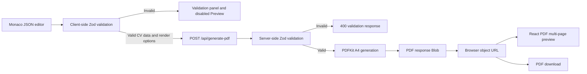

# ATS CV Generator

Create a polished, text-forward CV from structured JSON, validate it as you edit, and preview or download the result as an A4 PDF.

[](https://ats-cv-seven.vercel.app)


**[Open ATS CV Generator](https://ats-cv-seven.vercel.app)**

## Features

- **Structured CV editing:** Edit the bundled CV template in a Monaco Editor configured for JSON.
- **Immediate validation:** JSON syntax and the Zod CV schema are checked on every edit, with field-level errors shown in the validation panel.
- **Server-generated PDF:** A Node.js API route renders the validated data as an A4 PDF with PDFKit and bundled Roboto fonts.
- **Interactive preview:** React PDF renders every generated page and provides zoom controls from 50% to 200%.
- **Render options:** Place Technical Skills immediately after Professional Summary and include a Project Showcase when project data exists.
- **Optional profile details:** Add a photo plus GitHub, LinkedIn, and portfolio links.
- **Predictable output:** Preview and download the same generated PDF, or reset the editor and render settings to the bundled defaults.

## How it works

1. Edit the CV object in the left-hand Monaco JSON editor.
2. The client parses the JSON and validates it with Zod. Syntax or schema errors appear with their field path, clear the current PDF, and disable Preview.
3. Choose either render option if needed: **Technical Skills after Professional Summary** or **Include Project Showcase**.
4. Click **Preview** or **Refresh**. The client posts the validated CV and options to `/api/generate-pdf`, where the Node.js route validates the CV again and PDFKit generates an A4 PDF.
5. The client reads the response as a `Blob`, creates an object URL, and gives that same PDF to the multi-page React PDF preview and the download action.

The browser download removes whitespace from the CV title and name and saves a file such as `SeniorEngineer_JaneDoe_cv.pdf`. **Reset** restores the bundled CV JSON, turns both render options off, and clears the generated PDF.

## CV JSON format

The editor starts with a complete example. This smaller example is also valid and includes every top-level section:

```json
{
  "personalDetails": {
    "name": "Jane Doe",
    "title": "Senior Software Engineer",
    "phone": "+1 555 0100",
    "email": "jane@example.com",
    "location": "Remote"
  },
  "socialLinks": {
    "github": "github.com/janedoe",
    "linkedin": "linkedin.com/in/jane-doe"
  },
  "professionalSummary": "Software engineer experienced in building reliable web applications and APIs.",
  "experience": [
    {
      "company": "Example Co.",
      "role": "Senior Software Engineer",
      "period": "2022 - Present",
      "achievements": [
        "Led delivery of a multi-tenant platform used by distributed teams."
      ],
      "techStack": "TypeScript, Next.js, PostgreSQL"
    }
  ],
  "technicalSkills": [
    {
      "category": "Languages and frameworks",
      "skills": ["TypeScript", "React", "Next.js"]
    }
  ],
  "projects": [
    {
      "name": "Platform Toolkit",
      "link": "https://example.com/platform-toolkit",
      "description": "A reusable toolkit for internal product teams.",
      "tools": ["TypeScript", "Next.js"]
    }
  ],
  "education": [
    {
      "degree": "BSc in Computer Science",
      "institution": "Example University",
      "year": "2021"
    }
  ]
}
```

### Field reference

Arrays marked as required must contain at least one item. Strings marked as required must not be empty.

| Field | Type | Presence | Rules and use |
| --- | --- | --- | --- |
| `personalDetails` | object | Required | Header identity and contact information. |
| `personalDetails.name` | string | Required | Used in the PDF header and generated filenames. |
| `personalDetails.title` | string | Required | Professional title used in the header and browser download filename. |
| `personalDetails.phone` | string | Required | Displayed in the contact line. |
| `personalDetails.email` | string | Required | Must be a valid email address and becomes a mail link. |
| `personalDetails.location` | string | Required | Displayed in the contact line. |
| `personalDetails.photo` | string | Optional | Accepts an HTTP(S) URL, a `/public` path, a data URL, or raw base64 image data. |
| `socialLinks` | object | Required | May be empty because each child link is optional. |
| `socialLinks.github` | string | Optional | GitHub host/path text such as `github.com/janedoe`. |
| `socialLinks.linkedin` | string | Optional | LinkedIn host/path text such as `linkedin.com/in/jane-doe`. |
| `socialLinks.portfolio` | string | Optional | Portfolio host/path text such as `janedoe.dev`. |
| `professionalSummary` | string | Required | Non-empty summary rendered before the configurable content sections. |
| `experience` | array | Required | Contains at least one experience object. |
| `experience[].company` | string | Required | Non-empty employer or organization name. |
| `experience[].role` | string | Required | Non-empty role title. |
| `experience[].period` | string | Required | Non-empty display text for the employment period. |
| `experience[].location` | string | Optional | Shown beside the role when supplied. |
| `experience[].achievements` | string[] | Required | Contains at least one non-empty achievement. |
| `experience[].techStack` | string | Optional | Rendered as the experience's `Tech:` line. |
| `technicalSkills` | array | Required | Contains at least one skill-category object. |
| `technicalSkills[].category` | string | Required | Non-empty category label. |
| `technicalSkills[].skills` | string[] | Required | Contains at least one non-empty skill. |
| `projects` | array | Optional | May be omitted or empty; rendered only when it has items and Project Showcase is enabled. |
| `projects[].name` | string | Required | Non-empty project name. |
| `projects[].link` | string | Required | Must be a valid URL and is rendered as a clickable link. |
| `projects[].description` | string | Required | Non-empty project description. |
| `projects[].tools` | string[] | Required | Contains at least one non-empty tool name. |
| `education` | array | Required | Contains at least one education object. |
| `education[].degree` | string | Required | Non-empty degree or qualification. |
| `education[].institution` | string | Required | Non-empty institution name. |
| `education[].year` | string | Required | Non-empty display text for the year. |
| `education[].details` | string | Optional | Additional education details. |

### Render options

- **Technical Skills after Professional Summary** defaults to off. Enable it to render Professional Summary, Technical Skills, Experience, optional Project Showcase, then Education.
- **Include Project Showcase** defaults to off. Enable it to render `projects` after Experience and Technical Skills and before Education; the section is still omitted when `projects` is missing or empty.
- Changing either option clears the old preview. Click **Preview** or **Refresh** to generate a PDF with the new settings.

## Local development

Requirements: Node.js, npm, and Git.

```bash
git clone https://github.com/shaikhalamin/ats-cv.git
cd ats-cv
npm ci
npm run dev
```

Open [http://localhost:3000](http://localhost:3000).

### Available scripts

| Command | Purpose |
| --- | --- |
| `npm run dev` | Start the Next.js development server. |
| `npm run build` | Create an optimized production build. |
| `npm run start` | Serve the production build. Run `npm run build` first. |
| `npm run lint` | Run ESLint across the repository. |

### Testing and production build

```bash
node --test tests/*.test.mjs
npm run lint
npm run build
```

To exercise the optimized application locally after the build, run `npm run start` and open [http://localhost:3000](http://localhost:3000).

### Deploying to Vercel

1. Import [`shaikhalamin/ats-cv`](https://github.com/shaikhalamin/ats-cv) into the [Vercel dashboard](https://vercel.com/new).
2. Keep the automatically detected Next.js build settings and deploy.
3. `vercel.json` assigns the PDF route 1024 MB of memory and a 30-second maximum duration.

## Repository structure

```text
.
├── app/
│   ├── api/generate-pdf/route.ts  # Node.js PDF endpoint
│   ├── layout.tsx                 # Metadata and CV context provider
│   └── page.tsx                   # Split editor/preview interface
├── components/                    # Editor, validation, preview, and controls
├── lib/
│   ├── context/CvContext.tsx      # CV state, validation, request, and download flow
│   ├── pdf/generator.ts           # A4 PDFKit renderer
│   └── schemas/cv.schema.ts       # Zod CV schema and parsing helpers
├── public/                        # Fonts and bundled image assets
├── tests/                         # Node source-level regression tests
├── package.json                   # Scripts and dependencies
└── vercel.json                    # PDF function resource settings
```

Key entry points: [`app/page.tsx`](./app/page.tsx), [`components/JsonEditor.tsx`](./components/JsonEditor.tsx), [`components/CvPreview.tsx`](./components/CvPreview.tsx), [`lib/context/CvContext.tsx`](./lib/context/CvContext.tsx), [`lib/schemas/cv.schema.ts`](./lib/schemas/cv.schema.ts), [`lib/pdf/generator.ts`](./lib/pdf/generator.ts), and [`app/api/generate-pdf/route.ts`](./app/api/generate-pdf/route.ts).

## Data flow



## PDF generation API

`POST /api/generate-pdf` is the implementation endpoint used by the web interface. It reflects the current code and is not a versioned public API contract.

### Request

Send `Content-Type: application/json` using either the raw `CVData` object documented above or the wrapped request used by the UI:

```ts
type GeneratePdfRequest =
  | CVData
  | {
      cvData: CVData;
      options?: {
        placeTechnicalSkillsAfterSummary?: boolean;
        includeProjectShowcase?: boolean;
      };
    };
```

Non-boolean option values and omitted options are normalized to `false`.

### Generation options

| Option | Default | Effect |
| --- | --- | --- |
| `placeTechnicalSkillsAfterSummary` | `false` | Moves Technical Skills directly after Professional Summary. |
| `includeProjectShowcase` | `false` | Renders Project Showcase when the validated CV also has one or more projects. |

### Successful response

A successful request returns status `200` with the PDF bytes as the response body.

| Header | Value |
| --- | --- |
| `Content-Type` | `application/pdf` |
| `Content-Disposition` | An attachment filename computed as `cv-${name.replace(/\s+/g, '-')}.pdf` |
| `Content-Length` | Generated PDF byte length |
| `Cache-Control` | `no-cache` |

### Error responses

A parseable request whose CV data fails schema validation returns status `400`:

```json
{
  "error": "Validation failed",
  "details": [
    {
      "path": "personalDetails.email",
      "message": "Invalid email address"
    }
  ]
}
```

An unhandled request-parsing or PDF-generation failure returns status `500`:

```json
{
  "error": "Failed to generate PDF",
  "message": "Font files not found. Please ensure Roboto fonts are in public/fonts/"
}
```

## Tech stack

| Area | Technology |
| --- | --- |
| Application | Next.js 16 App Router, React 19, TypeScript |
| Styling | Tailwind CSS 4 |
| JSON editing | Monaco Editor for React |
| Validation | Zod 4 |
| PDF generation | PDFKit with bundled Roboto fonts |
| PDF preview | React PDF |
| Tests | Node.js built-in test runner |
| Deployment | Vercel |
