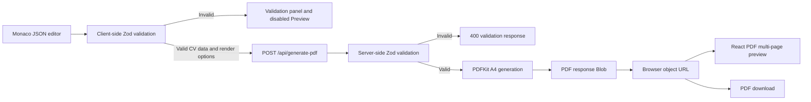

# README Refresh Implementation Plan

> **For agentic workers:** REQUIRED SUB-SKILL: Use superpowers:subagent-driven-development (recommended) or superpowers:executing-plans to implement this plan task-by-task. Steps use checkbox (`- [ ]`) syntax for tracking.

**Goal:** Replace the generic Create Next App README with a polished, product-first guide that explains ATS CV Generator, links to the deployed app, documents the supported CV JSON and PDF API, and gives verified local-development and deployment instructions.

**Architecture:** Keep this change documentation-only by replacing `README.md` and validating it with transient shell and Node.js checks instead of adding a permanent documentation test. Organize the README in the spec's product-to-implementation order, use the Zod schema and current source as the contract for field and API documentation, and finish with the repository's existing test, lint, and production-build commands.

**Tech Stack:** GitHub-flavored Markdown, Mermaid, Node.js built-in modules for transient documentation checks, npm, Next.js 16, React 19, TypeScript, Monaco Editor, Zod, PDFKit, React PDF, Tailwind CSS 4, Vercel.

## Global Constraints

- Link prominently to the live application at `https://ats-cv-seven.vercel.app`.
- Document only repository-verified behavior: Monaco-based JSON editing; JSON syntax and CV schema validation with field-level errors; server-side PDFKit generation; React PDF multi-page preview and zoom controls; title-and-name-based browser download filenames; optional Technical Skills placement; optional Project Showcase rendering; optional photo and social links; and reset to the bundled default CV.
- Document the exact client-to-server flow: edit JSON, validate with Zod, post valid CV data and render options to `/api/generate-pdf`, validate again in the Node.js route, generate an A4 PDF with PDFKit, and create a client object URL for preview and download.
- Explain that invalid JSON or schema violations disable generation and appear in the validation panel.
- Document the current `400` validation response and `500` generation response without presenting the route as a stable, versioned public API.
- Include local setup, all four npm scripts, the existing Node source-test command, lint, production build, production start, and Vercel dashboard deployment guidance.
- Include a compact valid JSON example and every required and optional field from `lib/schemas/cv.schema.ts`.
- Include a concise repository tree and a GitHub-compatible Mermaid data-flow diagram.
- Do not add a license section or claim that a license exists.
- Do not add contribution instructions, environment variables, or Yarn, pnpm, or Bun commands.
- Do not copy the bundled personal default CV dataset into the README.
- Do not add a screenshot; `public/1772549663703.png`, `public/shaikh_new_professional.webp`, and `public/cv-photo.jpg` are portraits, not current product screenshots.
- Add no dependencies and modify no application, schema, API, generator, configuration, asset, or existing test files.

---

## File Structure

- Modify: `README.md:1-35`
  - Replace the Create Next App template and trailing `# ats-cv` line with the complete product guide.
  - Keep product behavior, schema fields, API shapes, commands, deployment details, repository paths, and technology names aligned with the current source.

## Implementation Tasks

### Task 1: Replace the Template README With the Product Guide

**Files:**
- Modify: `README.md:1-35`
- Verify: `lib/schemas/cv.schema.ts`
- Verify: `lib/context/CvContext.tsx`
- Verify: `app/page.tsx`
- Verify: `components/JsonEditor.tsx`
- Verify: `components/CvPreview.tsx`
- Verify: `components/PdfPreviewDocument.tsx`
- Verify: `app/api/generate-pdf/route.ts`
- Verify: `lib/pdf/generator.ts`
- Verify: `package.json`
- Verify: `vercel.json`

**Interfaces:**
- Consumes: `CVDataSchema`, the client request shape `{ cvData, options }`, backward-compatible raw `CVData` requests, `PDFGenerationOptions`, API response headers and error JSON, the UI render-option labels, npm scripts, and Vercel function settings.
- Produces: A root `README.md` whose heading order, examples, field table, commands, data-flow diagram, links, API documentation, and exclusions match the approved design and current source.

- [ ] **Step 1: Run a focused check that proves the template README does not meet the product contract**

Run:

```bash
rg -n '^# ATS CV Generator$|https://ats-cv-seven\.vercel\.app|^## PDF generation API$' README.md
```

Expected: exit code `1` with no output because the current template has none of the required title, live URL, or API heading.

- [ ] **Step 2: Replace `README.md` with the complete product-first guide**

Replace the entire file with:

````markdown
# ATS CV Generator

Create a polished, text-forward CV from structured JSON, validate it as you edit, and preview or download the result as an A4 PDF.

[](https://ats-cv-seven.vercel.app)


**[Open ATS CV Generator](https://ats-cv-seven.vercel.app)**

## Features

- **Structured CV editing:** Edit the bundled CV template in a Monaco Editor configured for JSON.
- **Immediate validation:** JSON syntax and the Zod CV schema are checked on every edit, with field-level errors shown in the validation panel.
- **Server-generated PDF:** A Node.js API route renders the validated data as an A4 PDF with PDFKit and bundled Roboto fonts.
- **Interactive preview:** React PDF renders every generated page and provides zoom controls from 50% to 200%.
- **Render options:** Place Technical Skills immediately after Professional Summary and include a Project Showcase when project data exists.
- **Optional profile details:** Add a photo plus GitHub, LinkedIn, and portfolio links.
- **Predictable output:** Preview and download the same generated PDF, or reset the editor and render settings to the bundled defaults.

## How it works

1. Edit the CV object in the left-hand Monaco JSON editor.
2. The client parses the JSON and validates it with Zod. Syntax or schema errors appear with their field path, clear the current PDF, and disable Preview.
3. Choose either render option if needed: **Technical Skills after Professional Summary** or **Include Project Showcase**.
4. Click **Preview** or **Refresh**. The client posts the validated CV and options to `/api/generate-pdf`, where the Node.js route validates the CV again and PDFKit generates an A4 PDF.
5. The client reads the response as a `Blob`, creates an object URL, and gives that same PDF to the multi-page React PDF preview and the download action.

The browser download removes whitespace from the CV title and name and saves a file such as `SeniorEngineer_JaneDoe_cv.pdf`. **Reset** restores the bundled CV JSON, turns both render options off, and clears the generated PDF.

## CV JSON format

The editor starts with a complete example. This smaller example is also valid and includes every top-level section:

```json
{
  "personalDetails": {
    "name": "Jane Doe",
    "title": "Senior Software Engineer",
    "phone": "+1 555 0100",
    "email": "jane@example.com",
    "location": "Remote"
  },
  "socialLinks": {
    "github": "github.com/janedoe",
    "linkedin": "linkedin.com/in/jane-doe"
  },
  "professionalSummary": "Software engineer experienced in building reliable web applications and APIs.",
  "experience": [
    {
      "company": "Example Co.",
      "role": "Senior Software Engineer",
      "period": "2022 - Present",
      "achievements": [
        "Led delivery of a multi-tenant platform used by distributed teams."
      ],
      "techStack": "TypeScript, Next.js, PostgreSQL"
    }
  ],
  "technicalSkills": [
    {
      "category": "Languages and frameworks",
      "skills": ["TypeScript", "React", "Next.js"]
    }
  ],
  "projects": [
    {
      "name": "Platform Toolkit",
      "link": "https://example.com/platform-toolkit",
      "description": "A reusable toolkit for internal product teams.",
      "tools": ["TypeScript", "Next.js"]
    }
  ],
  "education": [
    {
      "degree": "BSc in Computer Science",
      "institution": "Example University",
      "year": "2021"
    }
  ]
}
```

### Field reference

Arrays marked as required must contain at least one item. Strings marked as required must not be empty.

| Field | Type | Presence | Rules and use |
| --- | --- | --- | --- |
| `personalDetails` | object | Required | Header identity and contact information. |
| `personalDetails.name` | string | Required | Used in the PDF header and generated filenames. |
| `personalDetails.title` | string | Required | Professional title used in the header and browser download filename. |
| `personalDetails.phone` | string | Required | Displayed in the contact line. |
| `personalDetails.email` | string | Required | Must be a valid email address and becomes a mail link. |
| `personalDetails.location` | string | Required | Displayed in the contact line. |
| `personalDetails.photo` | string | Optional | Accepts an HTTP(S) URL, a `/public` path, a data URL, or raw base64 image data. |
| `socialLinks` | object | Required | May be empty because each child link is optional. |
| `socialLinks.github` | string | Optional | GitHub host/path text such as `github.com/janedoe`. |
| `socialLinks.linkedin` | string | Optional | LinkedIn host/path text such as `linkedin.com/in/jane-doe`. |
| `socialLinks.portfolio` | string | Optional | Portfolio host/path text such as `janedoe.dev`. |
| `professionalSummary` | string | Required | Non-empty summary rendered before the configurable content sections. |
| `experience` | array | Required | Contains at least one experience object. |
| `experience[].company` | string | Required | Non-empty employer or organization name. |
| `experience[].role` | string | Required | Non-empty role title. |
| `experience[].period` | string | Required | Non-empty display text for the employment period. |
| `experience[].location` | string | Optional | Shown beside the role when supplied. |
| `experience[].achievements` | string[] | Required | Contains at least one non-empty achievement. |
| `experience[].techStack` | string | Optional | Rendered as the experience's `Tech:` line. |
| `technicalSkills` | array | Required | Contains at least one skill-category object. |
| `technicalSkills[].category` | string | Required | Non-empty category label. |
| `technicalSkills[].skills` | string[] | Required | Contains at least one non-empty skill. |
| `projects` | array | Optional | May be omitted or empty; rendered only when it has items and Project Showcase is enabled. |
| `projects[].name` | string | Required | Non-empty project name. |
| `projects[].link` | string | Required | Must be a valid URL and is rendered as a clickable link. |
| `projects[].description` | string | Required | Non-empty project description. |
| `projects[].tools` | string[] | Required | Contains at least one non-empty tool name. |
| `education` | array | Required | Contains at least one education object. |
| `education[].degree` | string | Required | Non-empty degree or qualification. |
| `education[].institution` | string | Required | Non-empty institution name. |
| `education[].year` | string | Required | Non-empty display text for the year. |
| `education[].details` | string | Optional | Additional education details. |

### Render options

- **Technical Skills after Professional Summary** defaults to off. Enable it to render Professional Summary, Technical Skills, Experience, optional Project Showcase, then Education.
- **Include Project Showcase** defaults to off. Enable it to render `projects` after Experience and Technical Skills and before Education; the section is still omitted when `projects` is missing or empty.
- Changing either option clears the old preview. Click **Preview** or **Refresh** to generate a PDF with the new settings.

## Local development

Requirements: Node.js, npm, and Git.

```bash
git clone https://github.com/shaikhalamin/ats-cv.git
cd ats-cv
npm ci
npm run dev
```

Open [http://localhost:3000](http://localhost:3000).

### Available scripts

| Command | Purpose |
| --- | --- |
| `npm run dev` | Start the Next.js development server. |
| `npm run build` | Create an optimized production build. |
| `npm run start` | Serve the production build. Run `npm run build` first. |
| `npm run lint` | Run ESLint across the repository. |

### Testing and production build

```bash
node --test tests/*.test.mjs
npm run lint
npm run build
```

To exercise the optimized application locally after the build, run `npm run start` and open [http://localhost:3000](http://localhost:3000).

### Deploying to Vercel

1. Import [`shaikhalamin/ats-cv`](https://github.com/shaikhalamin/ats-cv) into the [Vercel dashboard](https://vercel.com/new).
2. Keep the automatically detected Next.js build settings and deploy.
3. `vercel.json` assigns the PDF route 1024 MB of memory and a 30-second maximum duration.

## Repository structure

```text
.
├── app/
│   ├── api/generate-pdf/route.ts  # Node.js PDF endpoint
│   ├── layout.tsx                 # Metadata and CV context provider
│   └── page.tsx                   # Split editor/preview interface
├── components/                    # Editor, validation, preview, and controls
├── lib/
│   ├── context/CvContext.tsx      # CV state, validation, request, and download flow
│   ├── pdf/generator.ts           # A4 PDFKit renderer
│   └── schemas/cv.schema.ts       # Zod CV schema and parsing helpers
├── public/                        # Fonts and bundled image assets
├── tests/                         # Node source-level regression tests
├── package.json                   # Scripts and dependencies
└── vercel.json                    # PDF function resource settings
```

Key entry points: [`app/page.tsx`](./app/page.tsx), [`components/JsonEditor.tsx`](./components/JsonEditor.tsx), [`components/CvPreview.tsx`](./components/CvPreview.tsx), [`lib/context/CvContext.tsx`](./lib/context/CvContext.tsx), [`lib/schemas/cv.schema.ts`](./lib/schemas/cv.schema.ts), [`lib/pdf/generator.ts`](./lib/pdf/generator.ts), and [`app/api/generate-pdf/route.ts`](./app/api/generate-pdf/route.ts).

## Data flow



## PDF generation API

`POST /api/generate-pdf` is the implementation endpoint used by the web interface. It reflects the current code and is not a versioned public API contract.

### Request

Send `Content-Type: application/json` using either the raw `CVData` object documented above or the wrapped request used by the UI:

```ts
type GeneratePdfRequest =
  | CVData
  | {
      cvData: CVData;
      options?: {
        placeTechnicalSkillsAfterSummary?: boolean;
        includeProjectShowcase?: boolean;
      };
    };
```

Non-boolean option values and omitted options are normalized to `false`.

### Generation options

| Option | Default | Effect |
| --- | --- | --- |
| `placeTechnicalSkillsAfterSummary` | `false` | Moves Technical Skills directly after Professional Summary. |
| `includeProjectShowcase` | `false` | Renders Project Showcase when the validated CV also has one or more projects. |

### Successful response

A successful request returns status `200` with the PDF bytes as the response body.

| Header | Value |
| --- | --- |
| `Content-Type` | `application/pdf` |
| `Content-Disposition` | An attachment filename computed as `cv-${name.replace(/\s+/g, '-')}.pdf` |
| `Content-Length` | Generated PDF byte length |
| `Cache-Control` | `no-cache` |

### Error responses

A parseable request whose CV data fails schema validation returns status `400`:

```json
{
  "error": "Validation failed",
  "details": [
    {
      "path": "personalDetails.email",
      "message": "Invalid email address"
    }
  ]
}
```

An unhandled request-parsing or PDF-generation failure returns status `500`:

```json
{
  "error": "Failed to generate PDF",
  "message": "Font files not found. Please ensure Roboto fonts are in public/fonts/"
}
```

## Tech stack

| Area | Technology |
| --- | --- |
| Application | Next.js 16 App Router, React 19, TypeScript |
| Styling | Tailwind CSS 4 |
| JSON editing | Monaco Editor for React |
| Validation | Zod 4 |
| PDF generation | PDFKit with bundled Roboto fonts |
| PDF preview | React PDF |
| Tests | Node.js built-in test runner |
| Deployment | Vercel |
````

- [ ] **Step 3: Re-run the focused product-contract check**

Run:

```bash
rg -n '^# ATS CV Generator$|https://ats-cv-seven\.vercel\.app|^## PDF generation API$' README.md
```

Expected: exit code `0`; output includes the title on line 1, the linked live application near the top, and the PDF API heading after the data-flow section.

- [ ] **Step 4: Validate structure, schema coverage, Markdown fences, relative links, Mermaid content, commands, API behavior, and exclusions**

Run this transient Node.js check from the repository root:

```bash
node --input-type=module <<'NODE'
import assert from 'node:assert/strict';
import { access, readFile } from 'node:fs/promises';
import { pathToFileURL } from 'node:url';

const readmePath = `${process.cwd()}/README.md`;
const readmeUrl = pathToFileURL(readmePath);
const readme = await readFile(readmePath, 'utf8');

const orderedHeadings = [
  '## Features',
  '## How it works',
  '## CV JSON format',
  '## Local development',
  '## Repository structure',
  '## Data flow',
  '## PDF generation API',
  '## Tech stack',
];

let previousHeadingPosition = -1;
for (const heading of orderedHeadings) {
  const position = readme.indexOf(`${heading}\n`);
  assert.ok(position > previousHeadingPosition, `${heading} is missing or out of order`);
  previousHeadingPosition = position;
}

const requiredContent = [
  'https://ats-cv-seven.vercel.app',
  'Monaco Editor',
  'field-level errors',
  'PDFKit',
  'React PDF',
  'multi-page',
  'Technical Skills after Professional Summary',
  'Include Project Showcase',
  'SeniorEngineer_JaneDoe_cv.pdf',
  'node --test tests/*.test.mjs',
  'npm run lint',
  'npm run build',
  'npm run start',
  '1024 MB',
  '30-second',
  'POST /api/generate-pdf',
  'placeTechnicalSkillsAfterSummary',
  'includeProjectShowcase',
  'Content-Type',
  'application/pdf',
  '"error": "Validation failed"',
  '"error": "Failed to generate PDF"',
];

for (const content of requiredContent) {
  assert.ok(readme.includes(content), `missing required README content: ${content}`);
}

const requiredFieldRows = [
  '| `personalDetails` | object | Required |',
  '| `personalDetails.name` | string | Required |',
  '| `personalDetails.title` | string | Required |',
  '| `personalDetails.phone` | string | Required |',
  '| `personalDetails.email` | string | Required |',
  '| `personalDetails.location` | string | Required |',
  '| `personalDetails.photo` | string | Optional |',
  '| `socialLinks` | object | Required |',
  '| `socialLinks.github` | string | Optional |',
  '| `socialLinks.linkedin` | string | Optional |',
  '| `socialLinks.portfolio` | string | Optional |',
  '| `professionalSummary` | string | Required |',
  '| `experience` | array | Required |',
  '| `experience[].company` | string | Required |',
  '| `experience[].role` | string | Required |',
  '| `experience[].period` | string | Required |',
  '| `experience[].location` | string | Optional |',
  '| `experience[].achievements` | string[] | Required |',
  '| `experience[].techStack` | string | Optional |',
  '| `technicalSkills` | array | Required |',
  '| `technicalSkills[].category` | string | Required |',
  '| `technicalSkills[].skills` | string[] | Required |',
  '| `projects` | array | Optional |',
  '| `projects[].name` | string | Required |',
  '| `projects[].link` | string | Required |',
  '| `projects[].description` | string | Required |',
  '| `projects[].tools` | string[] | Required |',
  '| `education` | array | Required |',
  '| `education[].degree` | string | Required |',
  '| `education[].institution` | string | Required |',
  '| `education[].year` | string | Required |',
  '| `education[].details` | string | Optional |',
];

for (const row of requiredFieldRows) {
  assert.ok(readme.includes(row), `missing or misclassified field row: ${row}`);
}

const exampleMatch = readme.match(
  /## CV JSON format[\s\S]*?```json\n([\s\S]*?)\n```/,
);
assert.ok(exampleMatch, 'missing CV JSON example');
const example = JSON.parse(exampleMatch[1]);
assert.deepEqual(
  Object.keys(example),
  [
    'personalDetails',
    'socialLinks',
    'professionalSummary',
    'experience',
    'technicalSkills',
    'projects',
    'education',
  ],
  'CV example top-level fields do not match the documented schema order',
);

const fences = readme.match(/^```/gm) ?? [];
assert.equal(fences.length % 2, 0, 'Markdown code fences are unbalanced');

const mermaidMatch = readme.match(/```mermaid\n([\s\S]*?)\n```/);
assert.ok(mermaidMatch, 'missing Mermaid diagram');
assert.match(mermaidMatch[1], /^flowchart LR/m);
for (const nodeText of [
  'Monaco JSON editor',
  'Client-side Zod validation',
  'POST /api/generate-pdf',
  'Server-side Zod validation',
  'PDFKit A4 generation',
  'Browser object URL',
  'React PDF multi-page preview',
  'PDF download',
]) {
  assert.ok(mermaidMatch[1].includes(nodeText), `missing Mermaid node: ${nodeText}`);
}

const relativeLinks = [
  ...readme.matchAll(/\[[^\]]+\]\((\.\/[^)#]+)(?:#[^)]+)?\)/g),
].map((match) => match[1]);
assert.ok(relativeLinks.length >= 7, 'expected links to the documented source entry points');
for (const target of relativeLinks) {
  await access(new URL(target, readmeUrl));
}

assert.doesNotMatch(readme, /^## (?:License|Contributing)$/m);
assert.doesNotMatch(readme, /\b(?:yarn|pnpm|bun)\b/i);
assert.doesNotMatch(readme, /\.env|NEXT_PUBLIC_|process\.env/);
assert.doesNotMatch(readme, /!\[[^\]]*screenshot/i);
assert.doesNotMatch(readme, /Tixio|Liberate Labs|alamin\.cse15/i);

console.log('README validation passed');
NODE
```

Expected: exit code `0` and `README validation passed`.

- [ ] **Step 5: Run the existing source tests**

Run:

```bash
node --test tests/*.test.mjs
```

Expected: all `15` tests pass with `0` failures.

- [ ] **Step 6: Run ESLint**

Run:

```bash
npm run lint
```

Expected: exit code `0`. The two existing warnings in `scripts/pdfkit.cv.ts` for unused `LINE_GAP` and `lightFont` may remain; this documentation task must not modify that unrelated script.

- [ ] **Step 7: Run the production build**

Run:

```bash
npm run build
```

Expected: exit code `0`; Next.js compiles successfully, completes TypeScript and static-page generation, and reports `/api/generate-pdf` as a dynamic route.

- [ ] **Step 8: Review the rendered Markdown**

Open `README.md` in a GitHub-compatible Markdown preview and confirm:

1. The title, badges, and live-app call to action are visible before the first feature heading.
2. The heading order matches the design.
3. The CV example and both API error examples render as separate fenced blocks.
4. The field, script, API-option, response-header, and technology tables align correctly.
5. Every relative source link opens the intended repository file.
6. The Mermaid diagram renders left to right with separate invalid-validation and valid-generation branches.
7. No screenshot, license, contribution, environment-variable, alternate-package-manager, or personal-default-CV content appears.

- [ ] **Step 9: Review the scoped diff and commit**

Run:

```bash
git diff --check -- README.md
git diff -- README.md
git status --short
```

Expected: `git diff --check` produces no output; the README diff replaces only the generic template; no application, schema, API, generator, configuration, asset, or test file is modified. Preserve the pre-existing untracked `Senior_Software_Engineer_10years_ShaikhAlAmin.pdf`.

Commit:

```bash
git add README.md
git commit -m "docs: refresh project README"
```
